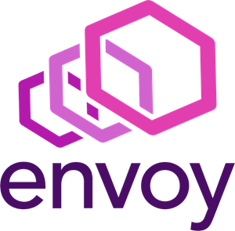
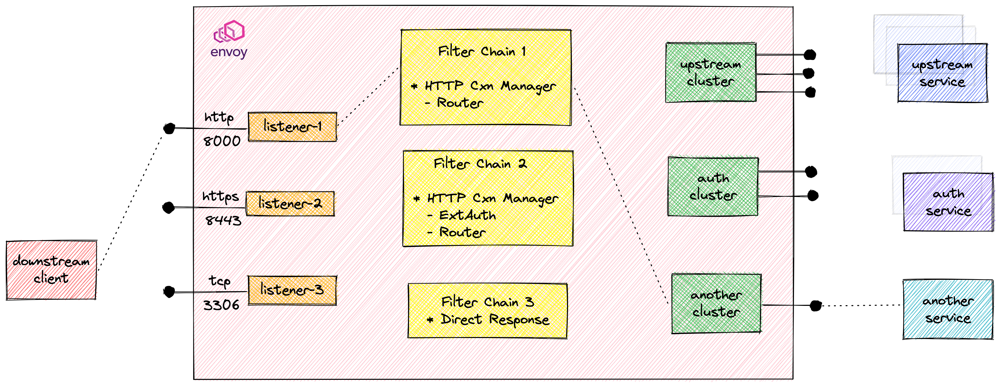
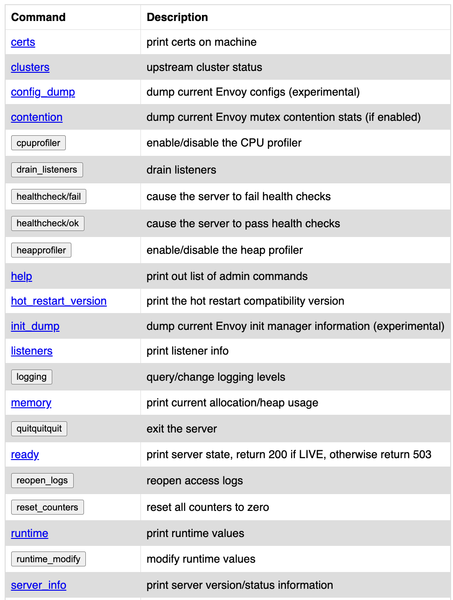
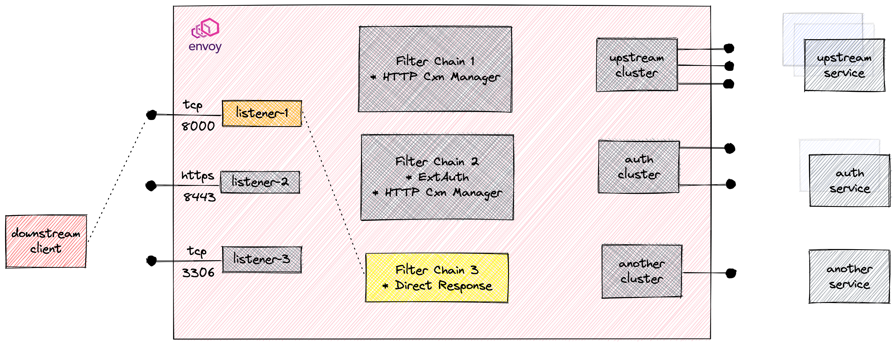
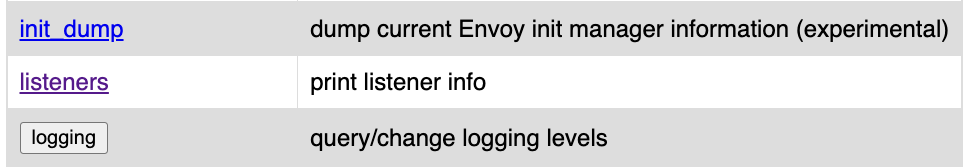
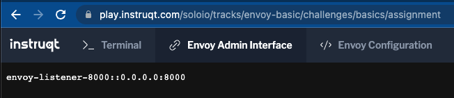
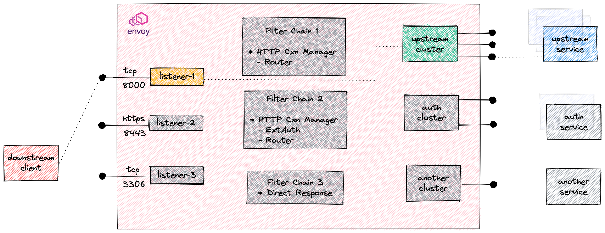
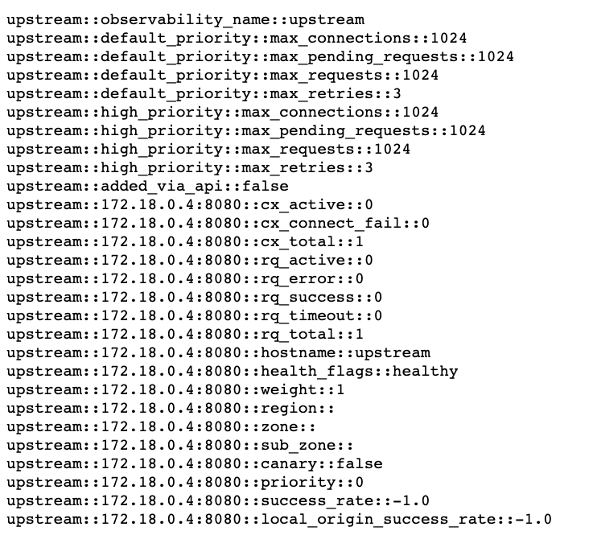

# 01 - Basic Envoy Proxy 


# พื้นฐานเกี่ยวกับ Envoy และ Envoy คืออะไร ?
 
**Envoy** เป็น **L4/L7 Proxy Cloud-Native** ที่ช่วยทำให้สามารถเกิดสิ่งที่เรียกได้ว่า "เครือข่ายควรจะโปร่งใส ให้กับแอปพลิเคชัน เมื่อเกิดปัญหาเครือข่ายและแอปพลิเคชัน ควรระบุแหล่งที่มาของปัญหาได้ง่าย"

## ความสามารถของ Envoy (Capabilities).

สำหรับสถาปัตยกรรมของ Envoy นั้นคือ พร็อกซีเครือข่าย Layer-3/Layer-4 ที่มีรองรับการทำ filter HTTP L7 ซึ่งด้วยคุณสมบัติเหล่านี้ Envoy สามารถจัดเตรียมคุณลักษณะต่างๆ เช่น ​buffering, rate-limiting, routing/forwarding และ traffic sniffing เป็นต้น

นอกจากนี้ Envoy ยังรองรับ HTTP/2 ด้วย โดยรองรับแบบ Full two-way ระหว่าง HTTP/1.1 และ HTTP/2 ได้.

Envoy มีความสามารถหรือ features อื่นๆ ตัวอย่างดังนี้:

- สามารถทำ HTTP L7 routing โดยส่งต่อ traffic ด้วย การพิจารณาจาก ข้อมูลบน HTTP Request Header.
- รองรับสำหรับการสื่อสาร gRPC.
- รองรับการทำ Service discovery และการตั้งค่าแบบ dynamic configuration ได้
- รองรับการทำ Health Checking ของ upstream hosts เพื่อให้มั่นใจว่า upstream ทำงานถูกต้อง และ return HTTP status codes ต่างๆ และค่า metric อื่นๆ ที่คาดหวังได้.
- รองรับการทำ Advanced load balancing.
- รองรับการพยายาม ร้องขอไปยังบริการที่มีความยืดหยุ่น (service resiliency) แบบอัตโนมัติ (Automatic retries )และกำหนดรูปแบบการตอบกลับเมื่อการร้องขอ เกิดล้มเหลว (Request Fail).
- รองรับการทำ Circuit breaking.
- รองรับการทำ Global rate limiting โดยใช้ external rate limiting service ได้.
- รองรับการร้องขอแบบ shadowning สำหรับการสังเกตเห็นทราฟฟิคจาก cluster หนึ่งๆ ไปยังที่อื่นๆ โดยใช้ fire & forget method.


- รองรับการตรวจจับค่าที่ผิดปกติ ซึ่งจะช่วยในกระบวนการ detection และ ejection process ให้เกิดการกำหนดค่าแบบไดนามิกได้ (dynamically) กับตัว upstream บน cluster บางเครื่องที่อาจจะทำงานไม่เหมือนกับ upstream ตัวอื่นๆ และทำการ remove หรือ ลบออกจากกลุ่ม ของ load balancer ทีทำงานปกติอยู่เดิม.



# Envoy Workshop Setup

ในการ workshop เราจะทำการใช้ Envoy docker container ด้วย Docker Compose. แต่เราจะเรียนรู้ผ่านทาง Kubernetes หรือ Linux environement ก็ได้เช่นกัน.

## Installation Envoy proxy

ในส่วน section นี้ เราจะทำการติดตั้ง Envoy โดยใช้ Docker และทำการ mount Envoy configs ผ่านทาง docker volumes ด้วยการใช้ docker compose ไฟล์. ลองเข้าไปดูใน workshop directory และตรวจสอบไฟล์ docker-compose สำหรับการตั้งค่า container และ Envoy config ที่จะ mount volume. จากนั้น คำสั่งใช้ docker-compose สำหรับสร้าง envoy containers.

เริ่มทำ Lab โดยการเข้าไปที่ directory workshop ก่อน:

```
cd $HOME/envoy-workshop-basics
```
ในส่วน tutorial เราจะทำการติดตั้งดังนี้:

- ติดตั้ง Envoy.
- ติดตั้ง demo service เราจะเรียกว่า `upstream` โดยเรียก path ด้วย `/hello`.
- ติดตั้งและปรับค่า บริการ `'auth'` สำหรับใช้ในการ ทดสอบ Envoy เรื่องการทำ `External authNZ feature`.
- ติดตั้ง `Grafana` และ `Prometheus` สำหรับ monitoring และ metrics collection.

ลองดูรายละเอียดของ docker-compose manifest ไฟล์ :
```
cat docker-compose.yaml
```
ทำการสร้าง envoy container โดยใช้คำสั่ง `docker-compose` ดังนี้ :
```
docker-compose up -d --build
```
ถ้า docker-compose stack สร้างเสร็จและพร้อมทำงานแล้ว เราสามารถเห็น containers ที่ทำงานอยู่ ได้จากคำสั่งนี้:
```
docker ps --format '{{ .Names }}'
```
เราจะเห็นชื่อของ containers ดังนี้:
```
envoy-workshop-basics_grafana_1
envoy-workshop-basics_prometheus_1
envoy-workshop-basics_envoy_1
envoy-workshop-basics_auth_1
envoy-workshop-basics_upstream_1
```

ตอนนี้ เราก็พร้อมใช้งาน Envoy เรียบร้อยแล้ว.

## Admin interface

Envoy Proxy จะ expose บน local Administrator interface เราสามารถดูราละเอียดต่างๆและแก้ไขค่าต่างๆ ของ Proxy ได้เอง โดยจะมีข้อมูลต่างๆ สำหรับ admin ตัวอย่างเช่น:

- ข้อมูล Cluster manager.
- ข้อมูล Cluster-wide.
- ข้อมูลสถิติของแต่ละ host และ counters (เช่น total connections, failures, timed-out requests, active request, etc.).
- ข้อมูลสถานะต่างๆ (health) ของ Host.

เมตริกเหล่านี้สามารถบอกเราได้ว่า Upstream Hosts ทำงานอย่างไร โดยอ้างอิงจากการแก้ไขและพารามิเตอร์ที่เราระบุไว้ใน Envoy
ตัวอย่างเช่น เราสามารถดูว่าการสื่อสารใดถูกส่งไปยัง Upstream Hosts และทราฟฟิกใดที่ถูกปฏิเสธ ที่สำคัญกว่านั้น สถิติอินเทอร์เฟซ สามารถเผยแพร่ไปยังระบบต่างๆ เช่น Prometheus และ Grafana เพื่อแสดงภาพข้อมูลนี้

**Configuration**
```
admin:
  access_log_path: /tmp/admin_access.log
  address:
    socket_address:
      protocol: TCP
      address: 127.0.0.1
      port_value: 19000
```
เราสามารถตรวจสอบการตั้งค่าจากไฟล์ envoy configuration ได้.

จากการตั้งค่าจะอนุญาตการเข้าถึง Envoy admin interface บนพอร์ต 19000 ที่ localhost. เราสามารถเปิด Envoy Admin Interface ผ่าน Browser ได้.


## Navigate the UI



## Listeners

Listener หมายถึง ชื่อตำแหน่งของเครือข่าย (เช่น port, unix domain socket ) ที่ downstream clients สามารถเชื่อมต่อเข้ามาได้. Envoy รองรับการ expose มากกว่าหนึ่ง Listeners ให้ downstream hosts เชื่อมต่อได้ ลองไปดูการตั้งค่า configuration กัน
```
git checkout lab1-2
```
จาก **Envoy admin UI** ลองคลิกเข้าไปที่ Envoy Configuration Tab เพื่อดูการตั้งค่าของ Listener configuration จะเห็นว่ามีการระบุการตั้งค่า listen สำหรับ traffic ขาเข้าจาก ANY IP หรือ IP Address ใดๆ ก็ได้ เข้ามายังพอร์ต `8000`.
```
static_resources:
  listeners:
  - name: envoy-listener-8000
    address:
      socket_address: { address: 0.0.0.0, port_value: 8000 }
```

## Listener Filters
จากที่กล่าวถึง Listener จะเห็นว่า เราสามารถใช้ข้อมูลจากการเชื่อมต่อมาทำ filters ให้กับ Listener ได้ แต่จุดประสงค์หลักของการทำ listener filter คือการทำการเพิ่มฟังก์ชันการทำงานต่างๆ โดยไม่ต้องทำการเปลี่ยนแปลงที่ของ `Envoy Core` ฟังก์ชัน และยังสามารถทำงานร่วมกันระหว่าง ฟังก์ชันต่างๆ ได้ง่ายและมีสิทธิภาพ.

สำหรับ API สำหรับ listener filters ค่อยข้างง่าย เพราะเนื่องจาก filters ทำงานบน sockets ที่ยอมรับการเชื่อมต่อเข้ามาใหม่. ตัว Filters ใน Chain สามารถหยุดและทำการดำเนินการวนซ้ำได้เพื่อ Filter เพิ่มเติมได้ ช่วยให้เพิ่มความสามารถในการทำงานที่ซับซ้อนได้ เช่น การเรียกบริการ rate limiting ซึ่งตัว Envoy มีตัว Listener fileter ที่หลากหลายแบบตาม Architecture ร่วมถึงการตั้งค่าต่างๆ อ้างอิงตาม documents.


### ตัวอย่าง Filter การทำ TCP direct response:



ตัวอย่างการตั้งค่า:
```
listeners:
  - name: envoy-listener-8000
    address:
      socket_address: { address: 0.0.0.0, port_value: 8000 }
    filter_chains:
    - filters:
      - name: envoy.filters.network.direct_response
        typed_config:
          "@type": type.googleapis.com/envoy.extensions.filters.network.direct_response.v3.Config
          response:
            inline_string: hello world
```
จากการตั้งค่าดังกล่าวมีรายละเอียดดังนี้:
- Listeners มีการตั้งค่าค่อยฟัง (listen) สำหรับ traffic ขาเข้า มาจาก IP address ใดๆ บนพอร์ต 8000.
- The direct_response network filter is applied to any incoming traffic on port 8000
- Network filter ชื่อ direct_response ใช้งานกับ Traffic ขาเข้าใดๆ บนพอร์ต 8000.
- ตัว filter ส่งข้อความ(string)  ว่า `hello world` ตอบกลับไป.

ทำการ Apply การตั้งค่า filter ด้วยการ restart envoy containers.
```
docker-compose restart envoy
```
ลองทดสอบเรียกไปยัง listener ด้วย cURL.
```
curl --http0.9  host:8000
```
เราควรจะเห็นคำตอบจาก Envoy ว่า:
```
hello world
```
ตามที่เราคาดหวัง คือ เราจะเห็นข้อความ `"hello world"` แสดงออกมา เพราะเราเรียกไปยัง proxy ตามพอร์ตที่ระบุ.

## Metrics
ตรวจสอบ `/listeners` endpoint ใน Envoy admin interface. โดยที่ `/listeners` เป็นรายการ endpoint ทั้งหมด ที่ปัจจุบัน listeners exposed บน Envoy.

## Debug Tip:
ถ้าเราเห็นว่า Envoy ไม่ตอบสนองการเชื่อมต่อใดๆ สำหรับการ Debugging ปัญหา สิ่งแรกให้ตรวจสอบ Listeners ว่าทำการ Exposed ถูกต้องหรือไม่?





## Envoy Cluster
`Cluster` คือ กลุ่มของเครื่อง hosts upstream ที่มี Logic คล้ายกัน ซึ่ง Envoy เชื่อมต่อ โดย Envoy จะค้นหาสมาชิก ของ cluster ผ่านทาง `Service Discovery`. สามารถเลือกตั้งค่า การตรวจสอบสถานะการทำงานอยู่  ของสมาชิก cluster ผ่านทาง `Active Health Checking` ได้. ในการระบุการร้องขอเข้าไปยังสมาชิกของ Cluster ผ่านทาง Envoy จะถูกกำหนดนโยบายโดย `Load Balancing Policy`.

### Configuration

เริ่มจากการดึงค่า configuration สำหรับการทดสอบ lab:

```
git checkout lab1-3
```
เราสามารถเพิ่ม cluster สำหรับการตั้งค่าของ Envoy ของเราโดยการเพิ่มบน YAML ไฟล์ในส่วนของ clusters: stanza ดังนี้:
```
clusters:
  - name: upstream
    connect_timeout: 0.25s
    type: STATIC_DNS
    lb_policy: ROUND_ROBIN
    load_assignment:
      cluster_name: upstream
      endpoints:
      - lb_endpoints:
        - endpoint:
            address:
              socket_address:
                address: upstream
                port_value: 8080
```
เมื่อกำหนด cluster แล้ว ซึ่งสามารถใช้กำหนดเส้นทางได้ ตัวอย่างเช่น เราสามารถใช้ตัวกรองนี้ในการกำหนดค่า TCP Filter ซึ่งจะกำหนดเส้นทางการรับส่งข้อมูลทั้งหมดไปยังคลัสเตอร์ที่อธิบายไว้ข้างต้น:
```
- filters:
  - name: envoy.filters.network.tcp_proxy
    typed_config:
      "@type": type.googleapis.com/envoy.extensions.filters.network.tcp_proxy.v3.TcpProxy
      cluster: upstream
      stat_prefix: passthrough
```


ทำการ Apply การตั้งค่าโดยการ retsart envoy container.
```
docker-compose restart envoy
```
ทดสอบ การตั้งค่า โดยใช้คำสั่ง:
```
curl localhost:8000/hello
```
Envoy จะตอบข้อความ กลับมาจาก upstream service. ซึ่งจะเห็น response ข้อความ ดังนี้
```
Hello back!
```

## Metrics
การใช้ admin Interface เราจะสามารถตรวจสอบ คุณสมบัติในการสร้างและค่าสถานะต่างๆ  healthy โดยดูจาก `/clusters` endpoint.

ด้วยค่า metrics จะเป็นตัวชี้วัดค่าของจำนวนการร้องขอบริการเข้ามายัง cluster, ค่าสถานะการตรวจสอบการทำงานต่างๆ และการตั้งค่าต่างๆ ของ endpoint ด้วย.




ถ้าไม่ต้องการใช้ browser ในการดูค่า metrics ต่างๆ สามารถใช้คำสั่งดังนี้ ได้:
```
curl -s http://localhost:19000/clusters | grep upstream
```
เรียบร้อย สำหรับรายละเอียดในส่วนของ basic ส่วนประกอบของ Envoy สำหรับส่วนต่อไปเราจะไปดู section ของ HTTP Connection Manager กัน.
